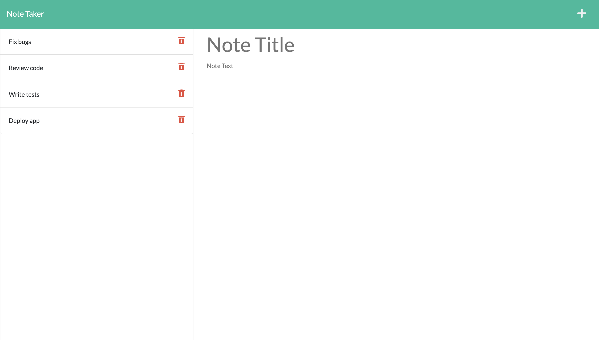

# Note taker

## Contents

- [Description](#Description)
- [Installation](#Installation)
- [Usage](#Usage)
- [Questions](#Questions)

## Description

For this project, I have used express.js to create a note taker that people can use to write, save and delete notes to easily keep track of work. Below is a screenshot of the application and you can try out the deployed application here - https://github.com/mattglwilliams/note-taker!



## Installation

To install this project, simple clone the repository, then run the below command to install all dependencies.

```
npm i
```

## Usage

Firstly, to use this app, make sure you have node.js installed. Once installed, follow the below steps:

- To start the application, open your terminal and navigate to the folder where you have just cloned the repo and run the below command.

```
npm run start
```

This will start the app and you can go to http://localhost:3001/ in your browser and start using the app!

## Questions

If you have any questions, you can contact me via GitHub or email me at mattwilliamsdev@gmail.com
